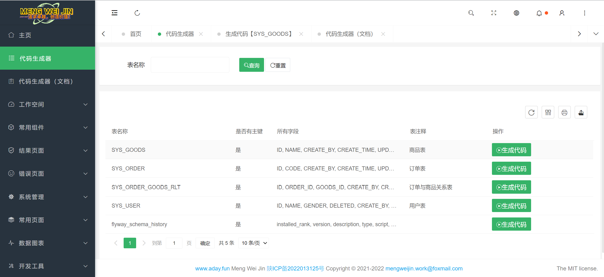
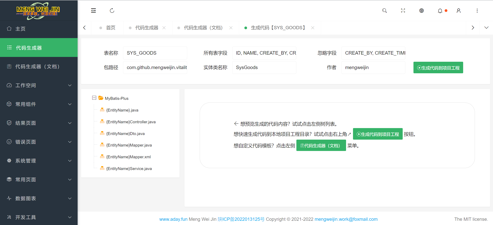
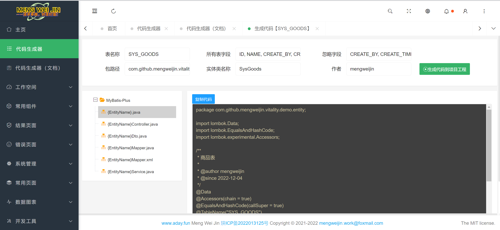
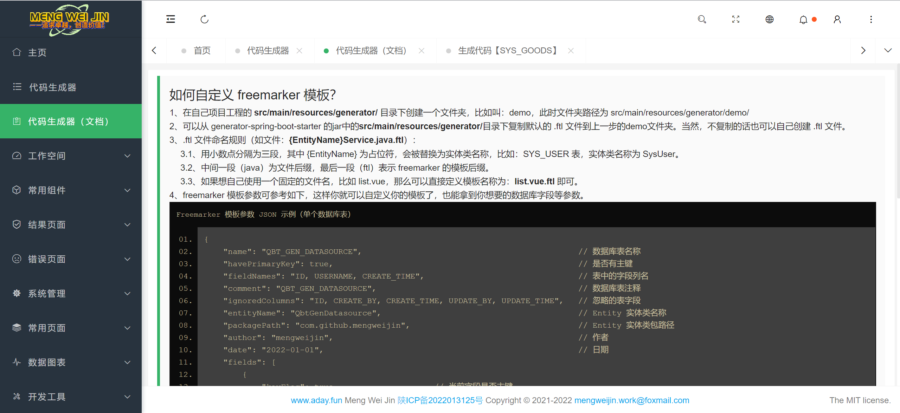

# Vitality
<p align="center">	
	<a target="_blank" href="https://search.maven.org/search?q=g:%22com.github.mengweijin%22%20AND%20a:%22vitality-spring-boot-starter%22">
		
	</a>
	<a target="_blank" href="https://github.com/mengweijin/quickboot/blob/master/LICENSE">
		
	</a>
	<a target="_blank" href="https://www.oracle.com/technetwork/java/javase/downloads/index.html">
		
	</a>
	<a target="_blank" href="https://gitee.com/mengweijin/vitality/stargazers">
		
	</a>
	<a target="_blank" href='https://github.com/mengweijin/vitality'>
		
	</a>
</p>

| 模块                            | 最新版本                                                                                                                                                                                                                                                |
|:------------------------------|:----------------------------------------------------------------------------------------------------------------------------------------------------------------------------------------------------------------------------------------------------|
| vitality-spring-boot-starter  | <a target="_blank" href="https://search.maven.org/search?q=g:%22com.github.mengweijin%22%20AND%20a:%22vitality-spring-boot-starter%22"></a>   |
| generator-spring-boot-starter | <a target="_blank" href="https://search.maven.org/search?q=g:%22com.github.mengweijin%22%20AND%20a:%22generator-spring-boot-starter%22"></a> |
| vitality-layui                | <a target="_blank" href="https://search.maven.org/search?q=g:%22com.github.mengweijin%22%20AND%20a:%22vitality-layui%22"></a>                               |

## 介绍
快速搭建 SpringBoot 项目，整合和配置常用的模块和功能，提供一些简单的工具，比如代码生成器等。

### vitality-spring-boot-starter
可以在任何 spring boot 工程中单独使用。
```xml
<dependency>
    <groupId>com.github.mengweijin</groupId>
    <artifactId>vitality-spring-boot-starter</artifactId>
    <version>${vitality.version}</version>
</dependency>
```
- 接口统一返回格式：R.java
- 操作日志统一打印。
- Ehcache3 集成和自动配置。
- 公共的上传/下载文件接口。
- 全局异常处理
- 可重复从 request 获取 body 的过滤器
- JdbcTemplate ColumnMapRowMapper 和动态加载 jdbc driver 包功能。
- debug 模式不缓存静态资源，如 static 目录下的文件。
- cors 跨域请求（vitality.cors.enabled=true）和 XSS 过滤配置（vitality.xss.enabled=true）
- mybatis plus 集成，create_time 等字段自动填充、基于用户、部门、角色等的 @DataScope 数据权限过滤器。
- redis 重复提交拦截器、限流拦截器
- 各种 util 工具类
- application.yml 配置加密 SafetyEncryptEnvironmentPostProcessor.java
- p6spy 数据库查询日志记录，自动记录每一条真实查询的 SQL 记录到 debug 日志中。

#### flyway
额外支持达梦数据库。
~~~yaml
spring:
  # flyway在spring boot中默认配置位置为：classpath:db/migration
  # flyway命名规则为：V<VERSION>__<NAME>.sql (with <VERSION> an underscore-separated version, such as ‘1’ or ‘2_1’)
  flyway:
    # 默认不启用
    enabled: true
    baseline-on-migrate: true
    locations:
      - classpath:db/migration/h2
      # - classpath:db/migration/mysql
      # - classpath:db/migration/oracle
~~~


### generator-spring-boot-starter
可以在任何 spring boot 工程中单独使用。
```xml
<dependency>
    <groupId>com.github.mengweijin</groupId>
    <artifactId>generator-spring-boot-starter</artifactId>
    <version>${generator.version}</version>
    <scope>provided</scope>
</dependency>
```
代码生成器，引用包后，启动程序，直接访问主页：http://localhost:8080/vitality/index.html

可以在线预览生成的代码，也可以直接生成代码到你的工程目录，方便复制和调整。

可以自定义 freemarker 模板来满足不同的代码需求。文档也访问主页：http://localhost:8080/vitality/index.html

#### 页面展示








### vitality-layui
漂亮的后台管理系统模板，方便实现简单页面，使用的是 pear-admin-layui 模板，这里做了些简单改动，并且打包为 jar 发布在 maven 中央仓库。

maven 引用后，启动程序，直接访问主页：http://localhost:8080/vitality/index.html
```xml
<dependency>
    <groupId>com.github.mengweijin</groupId>
    <artifactId>vitality-layui</artifactId>
    <version>${vitality-layui.version}</version>
</dependency>
```
