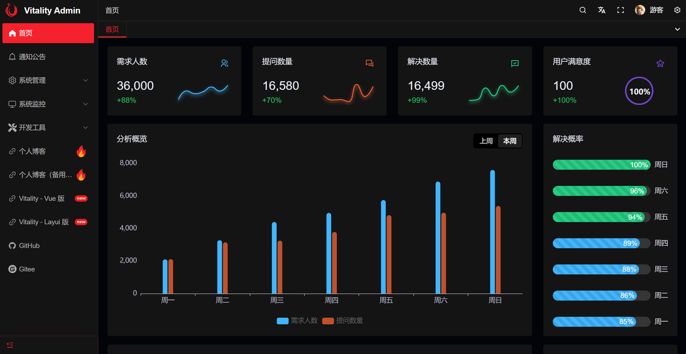
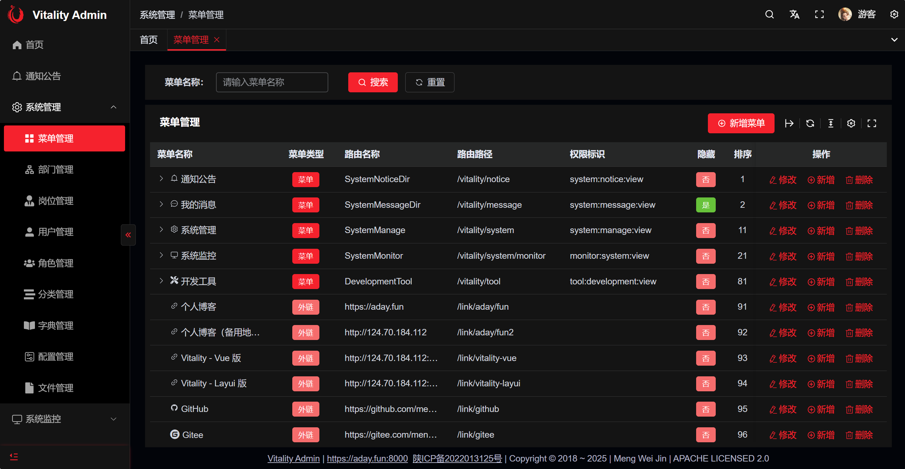
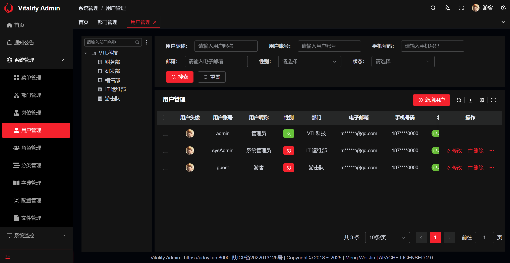
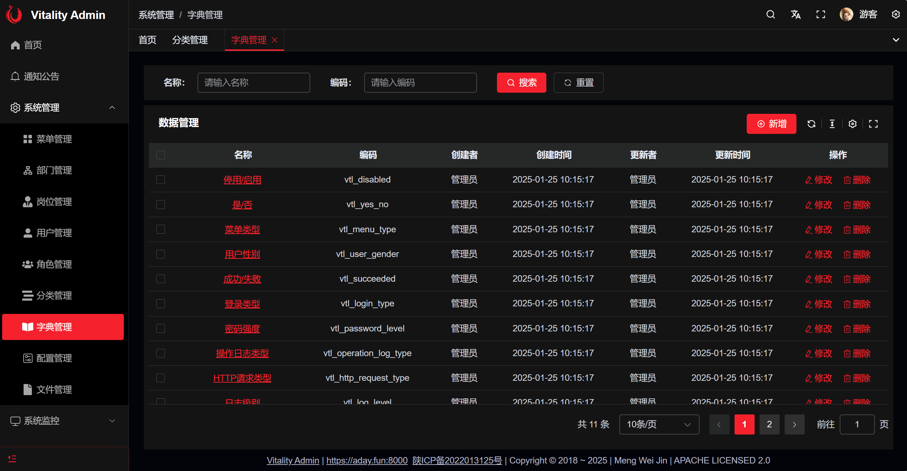
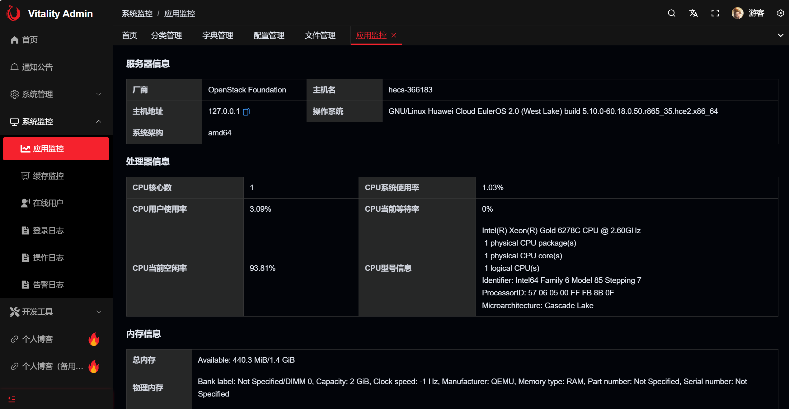
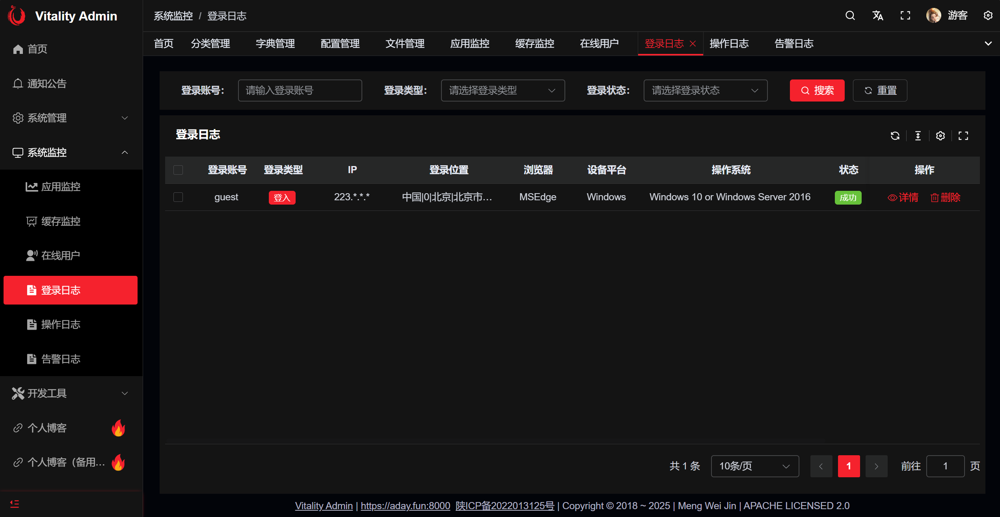
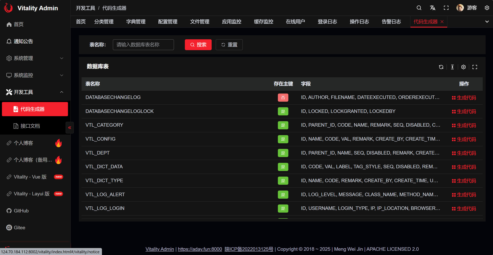
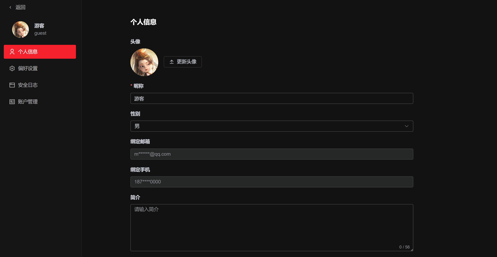

# Vitality
<p align="center">	
	<a target="_blank" href="https://search.maven.org/search?q=g:%22com.github.mengweijin%22%20AND%20a:%22vitality-parent%22">
		
	</a>
	<a target="_blank" href="https://github.com/mengweijin/vitality/blob/master/LICENSE">
		
	</a>
	<a target="_blank" href="https://www.oracle.com/technetwork/java/javase/downloads/index.html">
		
	</a>
	<a target="_blank" href="https://gitee.com/mengweijin/vitality/stargazers">
		
	</a>
	<a target="_blank" href='https://github.com/mengweijin/vitality'>
		
	</a>
</p>

## 介绍

基于 SpringBoot 3、sa-token、mybatis-plus、hutool、vue 3、element-plus 等 **前后端分离** 开发，不依赖任何第三方服务的超轻量级管理系统。

有时候我们就想做一个简单的东西，却要依赖一大堆 redis、文件服务、配置中心等一大堆东西，**真的太麻烦了！**

于是，就自己搞一个不依赖任何其他三方服务的后台管理系统，普通场景哪有那么多高并发！

### 在线演示
|           版本           |            演示链接            |
|:----------------------:|:--------------------------:|
|  Vitality Admin Vue 版  | http://124.70.184.112:8002 |
| Vitality Admin Layui 版 | http://124.70.184.112:8001 |

## 代码分支

* **maser 分支**：开发中......（请勿用于生产环境）；
* **V1.5-vue 分支**：SpringBoot 3、sa-token、mybatis-plus、hutool、vue 3、element-plus等（**过渡分支，生产慎用**）；
* **V1.4-layui 分支**：基于 SpringBoot 3、sa-token、mybatis-plus、hutool、layui、jquery 等（**暂停维护**）；


### 捉急请联系👇
|     QQ      |       邮箱        |
|:-----------:|:---------------:|
| 1002284406  | mwjwork@qq.com  |

#### 最简单的启动

你只需要一个 JDK 17 的运行环境，执行下面命令启动即可！

```shell
java -Dserver.port=8080 -Dspring.profiles.active=h2 -jar vitality-admin.jar
```

然后浏览器访问：http://localhost:8080。就是这么简单！

注：-Dspring.profiles.active=h2：使用 h2 数据库。生产环境可替换为其他关系型数据库。

### 系统功能

- 我的消息：系统消息列表查看和维护。
- 系统管理
  - 菜单管理：配置系统菜单、按钮基本信息及权限编码。
  - 部门管理：配置系统组织机构。
  - 岗位管理：系统用户所担任的岗位。
  - 用户管理：系统用户的管理。
  - 角色管理：角色管理，及其所拥有的菜单及按钮权限配置。
  - 分类管理：树状分类基础数据维护。
  - 字典管理：枚举字典值配置和管理。
  - 配置管理：对系统动态配置常用参数。
  - 文件管理：对系统上传的文件进行管理。
  - 通知公告：系统通知公告信息的发布维护。
- 系统监控 
  - 应用监控：监视当前系统的系统信息、CPU、内存、磁盘、JVM信息等。
  - 缓存监控：查看系统实时缓存数据。
  - 在线用户：当前系统中活跃用户状态监控及踢人下线。
  - 登录日志：系统登录日志记录和查询。
  - 操作日志：系统正常操作日志记录和查询；
  - 错误日志：系统异常信息日志记录和查询。
- 开发工具
  - 代码生成器：前后端代码的生成（java、vue、js、sql、脚本）支持代码直接下载。
  - 接口文档：后台接口文档。

### 开发功能

主要包含用户-部门-岗位-角色-菜单-权限管理、代码生成、数据脱敏、字典翻译、接口限流、日志管理、系统监控、缓存过期、接口防抖等功能。

### 演示图
|                                    |                                    |    
|-----------------------------------:|:-----------------------------------|
|  |  | 
|  |  | 
|  |  | 
|  |  | 


## 主要技术栈

后端：Spring Boot 3、sa-token、mybatis-plus、hutool 等。

前端：Layui、javascript、html、css、pear-admin-layui 4 模板等。

## ⭐Star Vitality on GitHub

[](https://starchart.cc/mengweijin/vitality)
