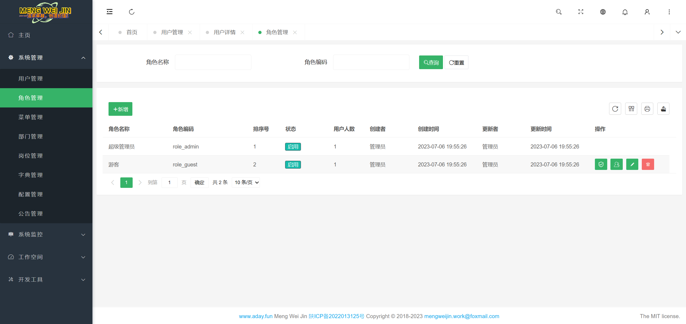
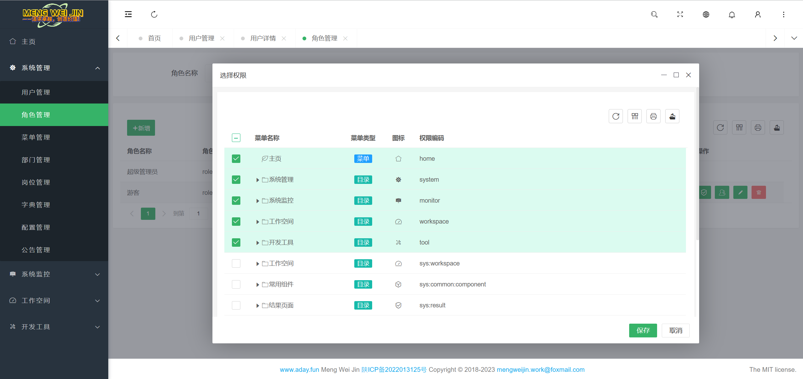
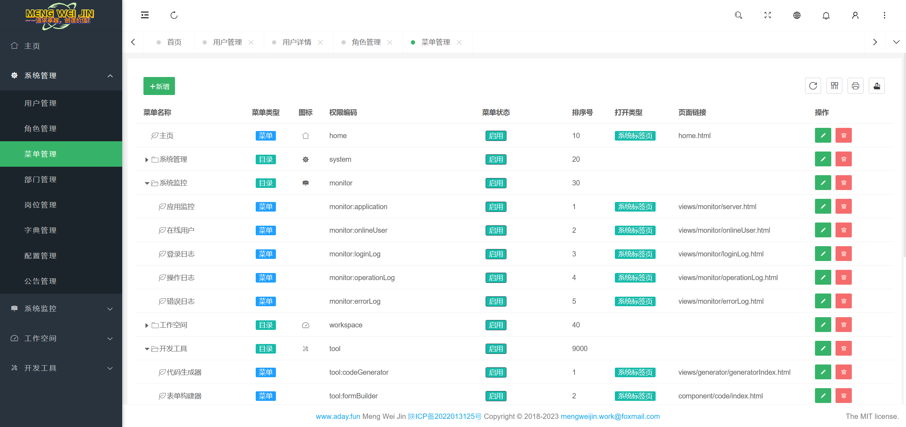
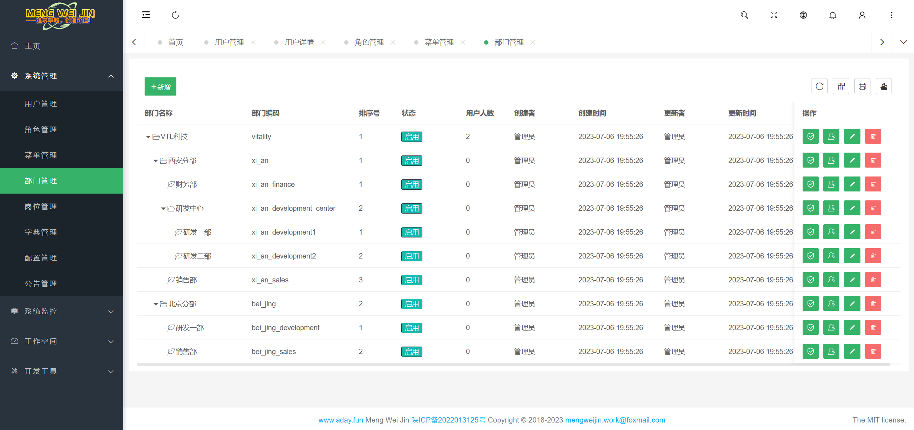
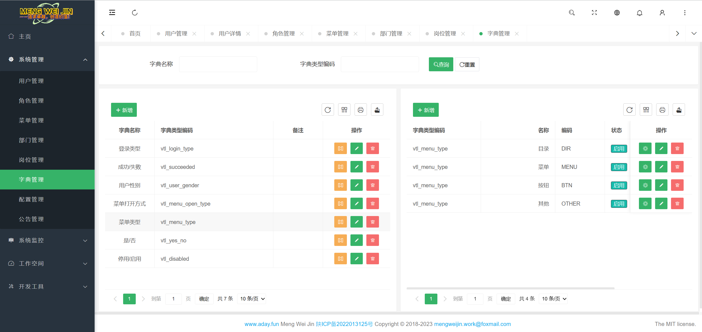
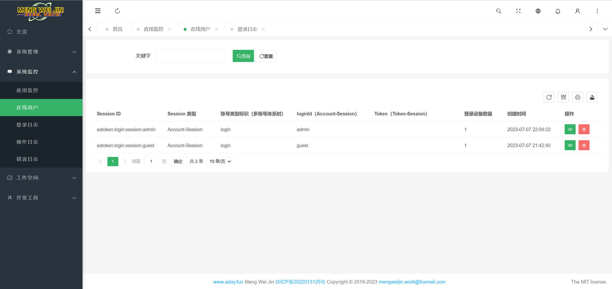
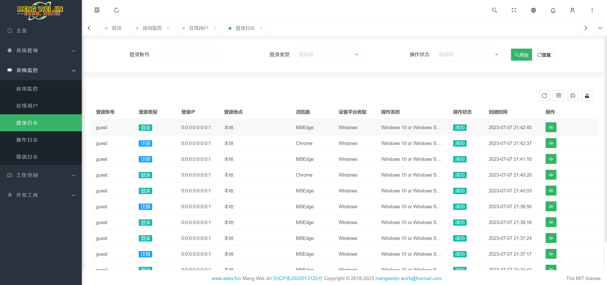
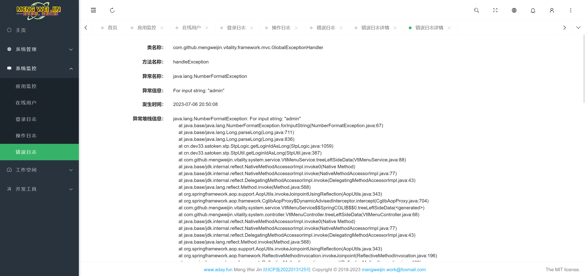
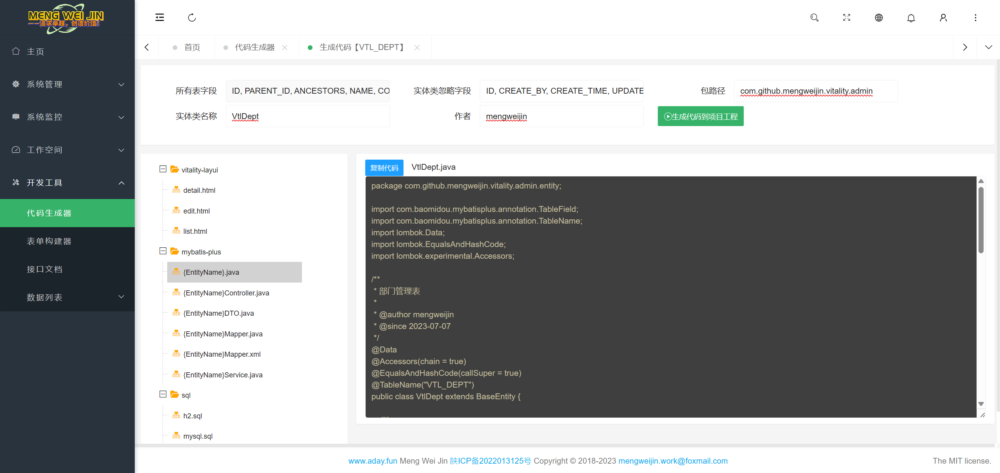

# Vitality
<p align="center">	
	<a target="_blank" href="https://search.maven.org/search?q=g:%22com.github.mengweijin%22%20AND%20a:%22vitality-parent%22">
		
	</a>
	<a target="_blank" href="https://github.com/mengweijin/vitality/blob/master/LICENSE">
		
	</a>
	<a target="_blank" href="https://www.oracle.com/technetwork/java/javase/downloads/index.html">
		
	</a>
	<a target="_blank" href="https://gitee.com/mengweijin/vitality/stargazers">
		
	</a>
	<a target="_blank" href='https://github.com/mengweijin/vitality'>
		
	</a>
</p>

## 介绍

基于 SpringBoot 3、sa-token、vue 3、element-plus等 **前后端分离**开发的轻量级管理系统。

有时候我们就想做一个简单的东西，却要依赖一大堆 redis、文件服务、配置中心等服务，两个字：**真的太麻烦了！**

于是，就自己搞一个麻雀虽小，五脏俱全的项目，不依赖任何其他三方服务，适合于一个人既是一个团队的小伙伴们。

小团队，哪有那么多高并发！

#### 最简单的启动

如果你觉得可以，数据库都不需要，就用默认的 h2 数据库。然后你只需要启动 jar 就行！

```shell
java -jar vitality-admin.jar
```

然后浏览器访问：http://localhost:8080 即可。就是这么简单！

### 内置功能

- 我的消息：系统消息列表查看和维护。
- 系统管理
  - 菜单管理：配置系统菜单、按钮基本信息及权限编码。
  - 部门管理：配置系统组织机构。
  - 岗位管理：系统用户所担任的岗位。
  - 用户管理：系统用户的管理。
  - 角色管理：角色配置，及其所拥有的菜单及按钮权限配置。
  - 分类管理：树状分类基础数据维护。
  - 字典管理：枚举字典值配置和管理。
  - 配置管理：对系统动态配置常用参数。
  - 文件管理：对系统上传的文件进行管理。
  - 通知公告：系统通知公告信息的发布维护。
- 系统监控 
  - 应用监控：监视当前系统的系统信息、CPU、内存、磁盘、JVM信息等。
  - 缓存监控：查看系统实时缓存数据。
  - 在线用户：当前系统中活跃用户状态监控及踢人下线。
  - 登录日志：系统登录日志记录和查询。
  - 操作日志：系统正常操作日志记录和查询；
  - 错误日志：系统异常信息日志记录和查询。
- 开发工具
  - 代码生成器：前后端代码的生成（java、html、sql、脚本）支持代码直接生成到工程目录下。
  - 表单构建器：拖动表单元素生成相应的HTML代码。
  - 接口文档：后台接口文档。

### 演示图
|                                                            |                                                                 |    
|-----------------------------------------------------------:|:----------------------------------------------------------------|
|             |                      | 
|             |               | 
|             |                  | 
|             |                  | 
|           |                   | 
|         |                | 
|       |                | 
|  |  | 

## 主要技术栈

后端：Spring Boot 3、sa-token、mybatis-plus、hutool 等。

前端：vue 3、element-plus、pinia、pure-admin 模板等。

## ⭐Star Vitality on GitHub

[](https://starchart.cc/mengweijin/vitality)
