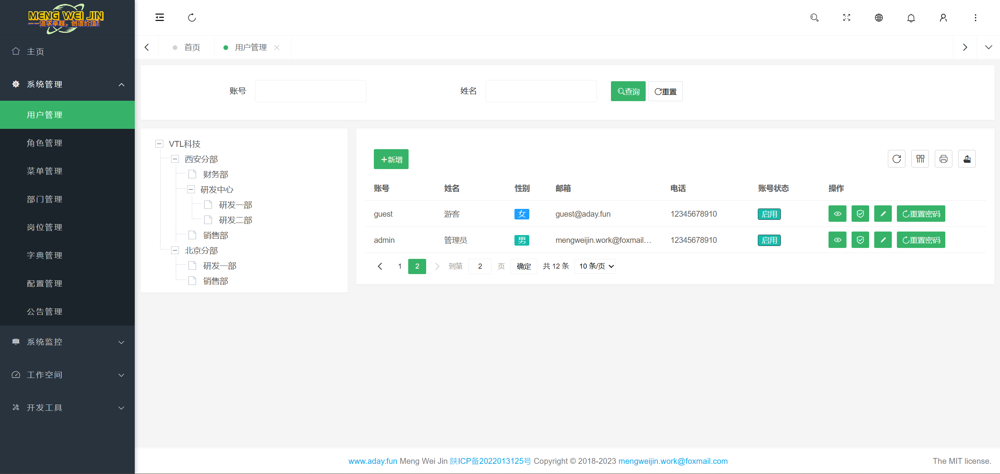
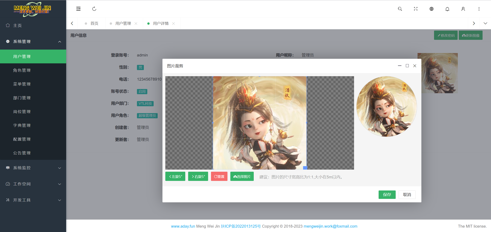
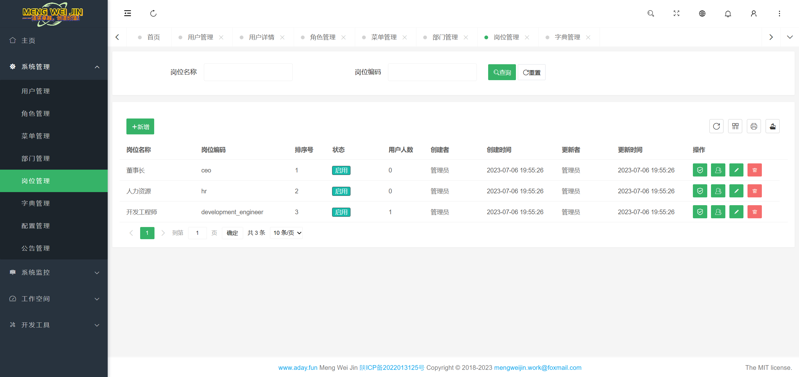
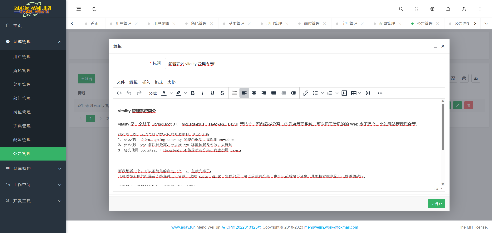
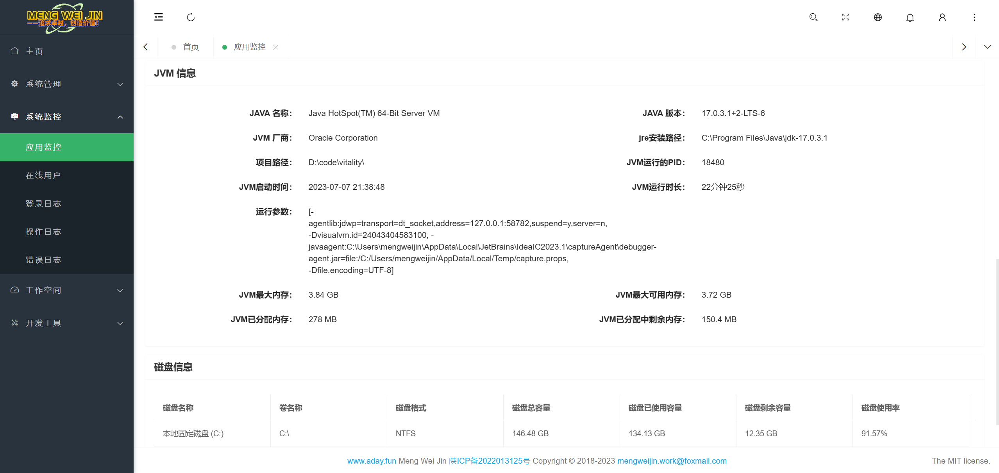
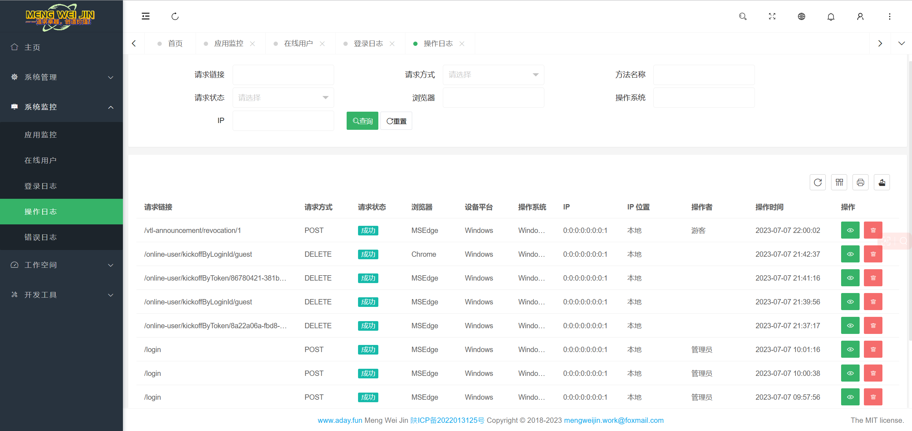

# Vitality

	
	
	
	
	
	

## 介绍
基于 SpringBoot 3+、sa-token、Layui 2.8+ **可前后端分离** 的后台管理系统，适合于一个人既是一个团队的小伙伴们，可以用于常见的的 Web 应用程序，比如网站管理后台等。

### 内置功能
- 系统管理
  - 用户管理：系统用户的管理，以及用户所拥有的菜单及按钮权限配置。
  - 角色管理：角色配置，以及角色所拥有的菜单及按钮权限配置。
  - 菜单管理：配置系统菜单、按钮基本信息及权限编码。
  - 部门管理：配置系统组织机构，以及部门所拥有的菜单及按钮权限配置。
  - 岗位管理：系统用户所担任的岗位，以及岗位所拥有的菜单及按钮权限配置。
  - 字典管理：对系统中经常使用的一些较为固定的数据进行维护。
  - 配置管理：对系统动态配置常用参数。
  - 公告管理：系统公告信息的发布维护。
- 系统监控 
  - 应用监控：监视当前系统的系统信息、CPU、内存、磁盘、JVM信息等。
  - 在线用户：当前系统中活跃用户状态监控及踢人下线。
  - 登录日志：系统登录日志记录和查询。
  - 操作日志：系统正常操作日志记录和查询；
  - 错误日志：系统异常信息日志记录和查询。
- 开发工具
  - 代码生成器：前后端代码的生成（java、html、sql、脚本）支持代码直接生成到工程目录下。
  - 表单构建器：拖动表单元素生成相应的HTML代码。
  - 接口文档：后台接口文档。
  - 数据列表：系统后台支撑的一些不能在前端直接查看的一些表的数据，方面某些问题定位时，可以查看，就不用进入数据库查看了。
    - 通知数据：系统通知信息的查看、发布维护。
    - 文件数据：系统上传文件后，产生的记录列表。

### 演示图
|                                                    演示图【列一】 | 演示图【列二】                                                         |    
|-----------------------------------------------------------:|:----------------------------------------------------------------|
|             |                      | 
|             |               | 
|             |                  | 
|             |                  | 
|           |                   | 
|         |                | 
|       |                | 
|  |  | 

